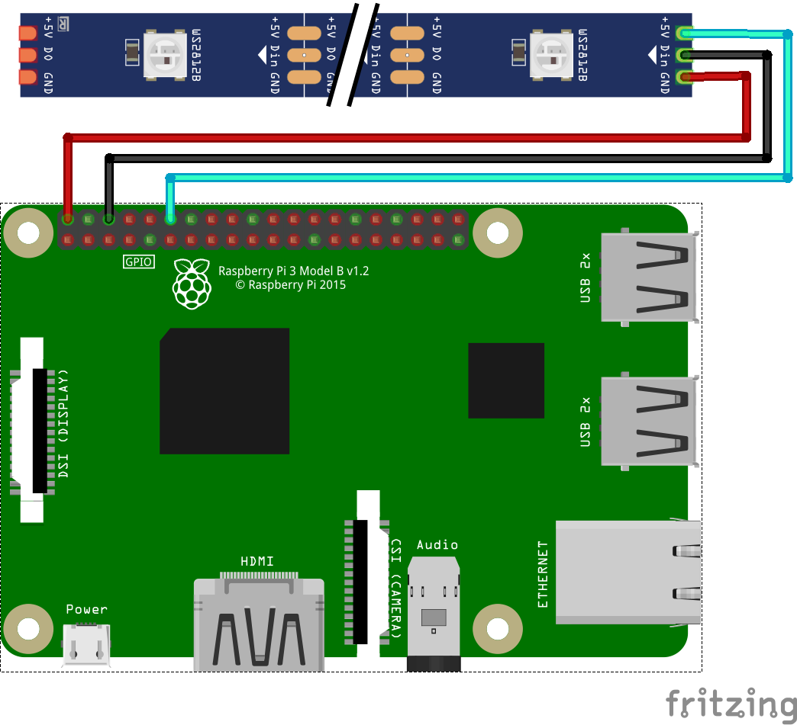

<h1 align="center">
  <br>
  🌈 RPi RGB LED 
  <br>
</h1>

<h4 align="center">Point and click. Instant feedback. Construct what you want.</h4>

<p align="center">
  <a href="https://opensource.org/licenses/MIT">
    
  </a>
  <a href="https://github.com/jwnicholas99/rpi-rgb-led/releases/">
    
  </a>
</p>

<p align="center">
  <a href="#key-features">Key Features</a> •
  <a href="#usage">Usage</a> •
  <a href="#setup">Setup</a> •
  <a href="#credits">Credits</a> •
  <a href="#license">License</a>
</p>

<p align="center">

</p>

RPi RGB LED has a <b>graphical user interface</b> (GUI) for easy visualization. It also has <b>pre-defined LED patterns</b> which you can quickly <b>chain together</b> to create your own sequences.

## Key Features
There are three key features: 
1. Pre-defined LED patterns
2. Construct your own sequence
3. GUI app which provides instant feedback

#### Pre-defined LED Patterns
There are 5 pre-defined LED patterns:
1. Color Wipe
2. Pulse
3. Wave
4. Rainbow Cycle
5. Rainbow Chase

#### Construct Your Own
To make even more awesome LED sequences, there is an option to construct your own sequences by chaining together the above pre-defined LED patterns. All you have to do is click a button to add the pre-defined LED pattern to your own LED sequence. 

#### GUI App
When you want to create a color sequence, you can use a color picker to visually choose the color you want, rather than finding hex codes like '#808000' through trial and error.

After picking the color, the LED strip will immediately display the chosen color sequence so that you can instant feedback.

Finally, the app makes it easy to chain patterns together by adding your chosen LED patterns to the construction page.

## Usage
```
usage: sudo main.py [OPTIONS]

Options:
  --led_count           Number of LED pixels
  --led_pin             GPIO pin to control LED strip
  --led_brightness      Brightness of pixels (between 0 and 255)
  --use_gui             Use GUI app or command-line
  -h, --help            show this help message and exit
```


## Setup

There are two simple parts to the set-up: wiring the circuit and installing required Python packages.

#### Wiring the Circuit

You only need the following hardware:
* Raspberry Pi 4B
* WS2812 or SK6812 RGB LED strip
* Three jumper wires

Connect them according to the diagram below:

<p align="center">

</p>

#### Installing

Install the following packages:

```
$ sudo pip3 install rpi_ws281x
$ sudo pip3 install tkinter
$ sudo pip3 install ttkthemes
$ sudo pip3 install tkcolorpicker
```

## Credits

* Python - Everything is written in Python
* [rpi-ws281x-python](https://github.com/rpi-ws281x/rpi-ws281x-python/blob/master/library/rpi_ws281x/rpi_ws281x.py) - Handles all the low-level stuff of controlling the LED strip
* [Tkinter](https://docs.python.org/3/library/tkinter.html) - Creates the GUI app

## License

This project is licensed under the MIT License - see the [LICENSE.md](LICENSE.md) file for details


